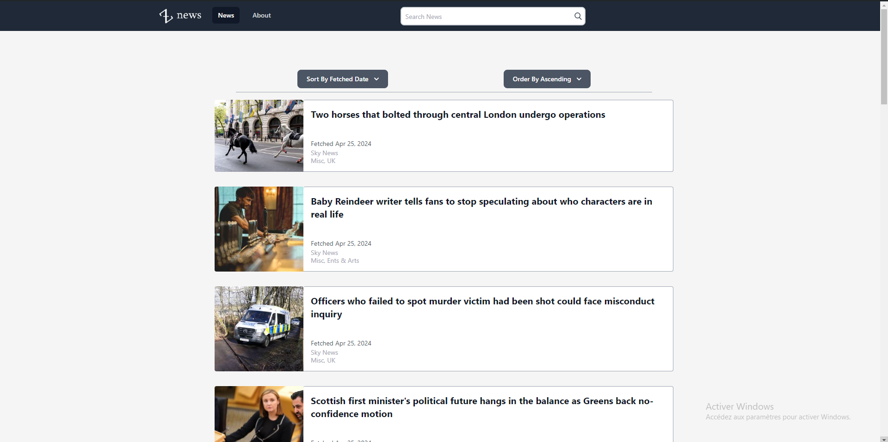

# Znews

This is an automated news aggregator, based upon the Express.js/Angular tech stack. Under the hood, it uses either Puppeteer to access Web pages from which to scrap news, or it directly contacts APIs to do so.

## Features

- Automated Web page and API news article scraping
- Pagination
- UI responsiveness
- Sorting options
- Query filters
- Automated reception of newer articles

## Gallery



## Architecture

It's mainly composed of a back-end server, running on Express.js, and an Angular front-end UI.
Both communicate through HTTP and WebSocket protocols.
The communication line based on HTTP is used to fetch static assets such as the UI, or images tied to news stored in the back-end server.

## Configuration

### Sources

Inside of the config file, add any source you'd like in the news-source.json configuration file, in its `sources` array.
Any source must have these properties:

| name                                                 | identifier                        | url               | country               | tags                                           | sourceType         | newsPointer                                                                  | selectors                                                                                   | fetchNames                                                                                                               | modifiers                                                                                                                                                                  |
| ---------------------------------------------------- | --------------------------------- | ----------------- | --------------------- | ---------------------------------------------- | ------------------ | ---------------------------------------------------------------------------- | ------------------------------------------------------------------------------------------- | ------------------------------------------------------------------------------------------------------------------------ | -------------------------------------------------------------------------------------------------------------------------------------------------------------------------- |
| The name of the source. Will be displayed on the UI. | The source's internal identifier. | The source's url. | The source's country. | Tags associated to the source, a string array. | The source's type. | A pointer describing where the source's news are, and how they are accessed. | An array of strings containing data indicating how each element of a news article is found. | An array of strings indicating how the associated element, in the same index in the selectors array is named internally. | An array of string indicating how each of a news article's elements is to be altered when fetched. Also associated to a corresponding selectors element through its index. |

The `sourceType` source property follows either formats:

| format       | description                                                                     |
| ------------ | ------------------------------------------------------------------------------- |
| api%(method) | Describes a source pointing to an API, and the HTTP method to use to access it. |
| page         | Describes a source pointing to a Web page, accessed through a scraper.          |

The `newsPointer` source property follows either formats:

| format                   | description                                                                                                  |
| ------------------------ | ------------------------------------------------------------------------------------------------------------ |
| json%(property path)     | Indicates the array property containing the news articles relative to the object returned by the source API. |
| page%(property selector) | Indicates the CSS selector pointing to a news article.                                                       |

The `selectors`, `fetchNames` and `modifiers` properties must be string arrays and describe how and where a specific property tied to a news article is to be found.
All elements of these three arrays are respectively tied through their array index such that any triplet describes a news article property.

Any string within the `selectors` source property must follow either formats:

| format                                                   | description                                                                                                             |
| -------------------------------------------------------- | ----------------------------------------------------------------------------------------------------------------------- |
| json%(property path relative to the news article object) | Indicates an object property's path as obtained through an API.                                                         |
| dom-attrib%(CSS selector)%(HTML attribute)               | Indicates a property taken from a DOM element specified by a CSS selector and an HTML attribute, through a Web scraper. |
| dom-content%(CSS selector)                               | Indicates a property taken from a DOM element, through its text content.                                                |
| none                                                     | Indicates an empty string.                                                                                              |
| none-array                                               | Indicates an empty array.                                                                                               |

Any string within the `fetchNames` source property must be of either values:

| value       | description                          | optional? |
| ----------- | ------------------------------------ | --------- |
| url         | The news article URL.                | No        |
| authors     | The news article's authors.          | No        |
| title       | The news article's title.            | No        |
| description | The news article's description.      | Yes       |
| images      | The news article's images.           | Yes       |
| tags        | The news article's tags.             | Yes       |
| reportedAt  | The news article's publication date. | Yes       |

### Sources with API parameters

Inside of the config file, create a backend-.env file. If you use any APIs which requires a key to access, this is a necessary step. The default News API source does. If you whish to use it, go to https://newsapi.org/, get an API key. Inside of the backend-.env file, add a line following this format:

```
SOURCEPARAM<source identifier>=<URL parameter>%<key>
```

As an example, the source identifier for the News API by default is newsapi. The key is passed through its URL as the apiKey parameter. If they key is `mykey`, the line to be added is thusly:

```
SOURCEPARAMnewsapi=apiKey%mykey
```

The back-end server will automatically take it into account and append the parameter to the source's URL.
